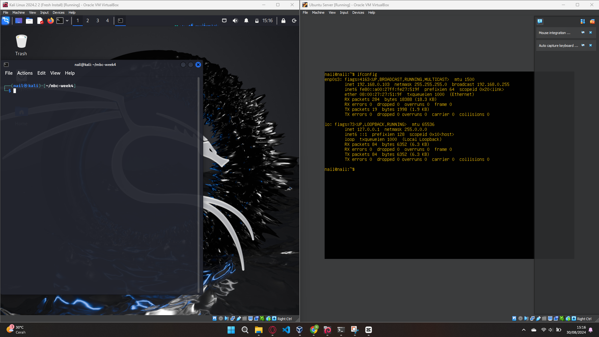

# BASEC - Basic Network Scanning Tools

BASEC adalah sekumpulan alat yang digunakan untuk network scanning.
Alat yang dimaksud ialah:
  - ARP scanning,
  - Port Scanning,
  - Trace Route.

Alat ini dijalankan menggunakan Python versi 3 dan menggunakan OS berbasis Linux.

[](https://github.com/NailYusra/BASEC/releases)
[](https://github.com/NailYusra/BASEC/issues)
[](https://github.com/NailYusra/BASEC/)
[](https://github.com/NailYusra/)
[](https://www.linkedin.com/in/nail-zaidan/)


## Instalasi

Instal versi 3 python

```bash
  sudo apt install python3
```

Instal python packet manager

```bash
  sudo apt install python3-pip
```

Instal dependency scapy

```bash
  pip install scapy
```

Install BASEC menggunakan git-clone

```bash
  git clone https://github.com/NailYusra/BASEC.git
```

Pergi ke direktori file BASEC

```bash
  cd BASEC/
```

Pergi ke direktori file Batch untuk running kode
```bash
  cd Batch/
```

Jalankan skrip Gabungan.py
```bash
  python3 Gabungan.py
```


## Demo Penggunaan

[](https://youtu.be/8l_9e9OaYj8?si=UPKKpIJe9dYZ123X)

Video Berisi Demo Penggunaan Alat
```bash
! Klik Video Diatas ! 
```


## Media Penggunaan

**Client:** Linux (Kali)

**Server:** Linux (Kali)


## 🔗 Referensi
https://www.geeksforgeeks.org/port-scanner-using-python/
https://stackoverflow.com/questions/71399009/what-is-the-difference-between-sr-and-srp-scapy
https://gist.github.com/jcjones/0f3f11a785a833e0a216
https://stackoverflow.com/questions/59589190/python-arp-scanner
https://www.geeksforgeeks.org/traceroute-implementation-on-python/


### Pemilik

- [@NailYusra](https://github.com/NailYusra/BASEC)
